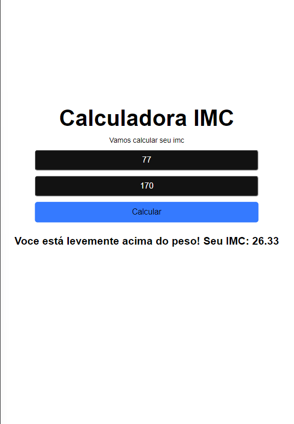

# Calculadora-IMC

<!---Esses são exemplos. Veja https://shields.io para outras pessoas ou para personalizar este conjunto de escudos. Você pode querer incluir dependências, status do projeto e informações de licença aqui--->

> Calculadora de IMC desenvolvida em reactjs

Projeto Criado na primeira aula da <a href="https://www.youtube.com/watch?v=K-8YYSEYaB8">Semana React Js</a> - <a href="https://www.linkedin.com/company/sujeitoprogramador/">Sujeito Programador</a>

<a href="https://juliocesarj.github.io/Calculadora-IMC/">Clique aqui para ver o projeto</a>
